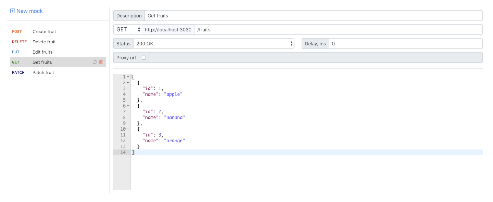

# API Mock
A small web service based on [Next.js](https://nextjs.org/) with simple UI to mock web services. Might be useful in cases when a web service is still in development, but the desired endpoints schema is already known. Or when the mocked Api is making calls to database/another Apis which takes long time to response or produces undesired side effects.

## Usage
To run the app, glone the repository, then run

`npm install && npm start`

### UI
Navigate to http://localhost:3030/ui.
The visual part of the app consists of one page. On the left pane there is a list of all configured mocks and on the right side the selected mock configuration.

### Api mock
Now that you have configured your mocks, you can call them from your application as you would normally do with a real web service. The base url for all the mocks is http://localhost:3030. For example, to list all the contracts from the preconfigured exmaple, just call

`curl http://localhost:3030/contracts`

And it will return you the result

`[{"id":1,"name":"apple"},{"id":2,"name":"banana"}]`

### Traits

* When mock does not exist, service will return 404 status code.
* When mock has a query parameter, it must be matched with request to return the mocked response, but all extra query parameters (existing only in request, but not in the mock) are ignored.

## TODO

* [x] Add support for query string parameters
* [x] Fix example in readme
* [ ] Add support for response headers
* [ ] Add support for other content types (xml?)