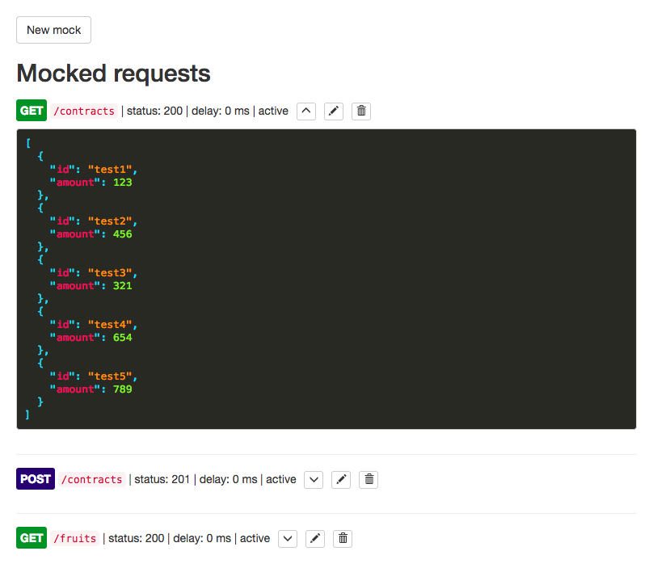
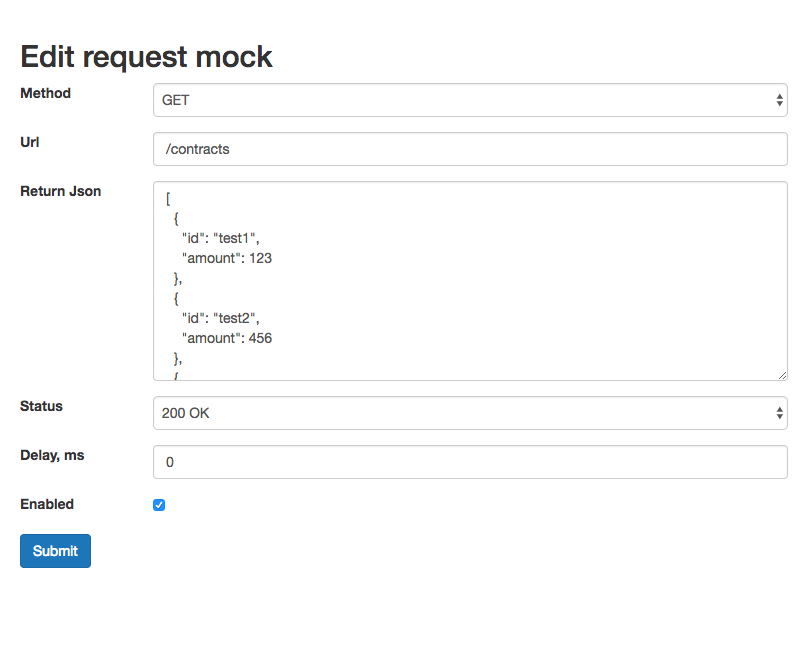
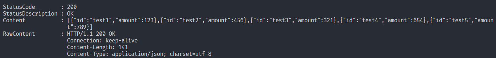

# API Mock
A small web service based on [Next.js](https://nextjs.org/) with simple UI to mock web services. Might be useful in cases when a web service is still in development, but the desired endpoints schema is already known.

## Usage
To run the app, glone the repository, then run

`npm install && npm start`

### UI
Navigate to http://localhost:3030/ui.
The visual part of the app consists of two pages. The first page shows all mocks that are currently set up.

This page provides CRUD operations on available mocks.

The second page is accessible when you either click "New mock" button or click edit button on selected mock.

### Api mock
Now that you have configured your mocks, you can call them from your application as you would normally do with a real web service. The base url for all the mocks is http://localhost:3030. For example, to list all the contracts from the preconfigured exmaple, just call

`curl http://localhost:3030/contracts`

And it will return you the result

## Limitations
For simplicity, following limitations apply
* Only json responses are supported.
* Mocks are stored in local json file.

In case the mock does not exist or disabled, service will return 404 status code.